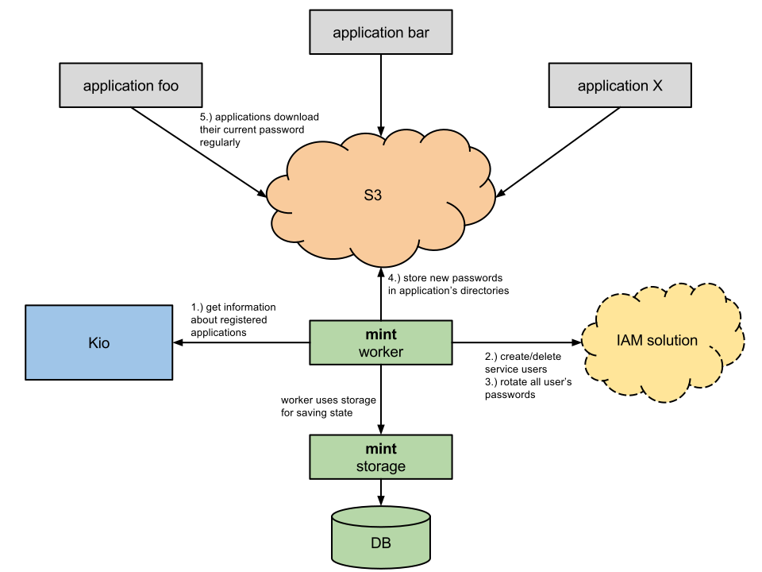
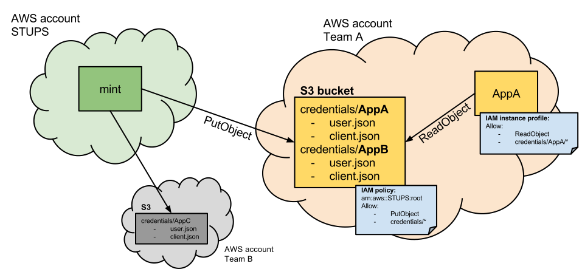

.. _mint:

====
Mint
====

**Mint** is STUPS' secret distributor and rotator. Its main task is to constantly rotate service passwords or API keys
and provide the secrets to the actual applications.

How it works
============

Step 1 + 2
----------

At first, mint makes sure, that for every registered application has an own 'service user' in the IAM solution. It then
also deletes all users that are either inactive or do not even exist in Kio.

Step 3 + 4
----------

mint will regularly rotate the passwords and OAuth 2.0 credentials for all service user's. The new secrets are then
stored in S3 buckets in the owning team's AWS accounts, where each registered application has one directory. mint
has write access to those directories for updating the secrets but no read access.

Step 5
------

Applications can download their current secrets from their directory on S3 using their instance profiles. A team has to
configure access to the correct credentials for their server. It is the application owner's responsibility to assign
the correct IAM profiles to the actual EC2 instances. :ref:`berry` can help with the permanent retrieval of the
application's secrets.

The following picture demonstrates the exchange over S3:

API for applications
====================

mint stores all credentials of an application in a directory in S3. At first, you have to know in which S3 bucket mint
stores everything. Knowing that, you can construct the correct URLs to it:

* https://mints-s3-bucket.amazonaws.com/my-app-id/user.json
* https://mints-s3-bucket.amazonaws.com/my-app-id/client.json

    <s3 bucket> / <app-id> / [user|client].json

The 'user.json' contains username and password of the service user. The 'client.json' contains the OAuth 2.0 client
credentials. You should download the files via the AWS SDKs but you could also construct the HTTP request yourself
according to the Amazon documentation. The two files have the following content:

user.json:

.. code-block:: json

    {
        "application_username": "abc",
        "application_password": "xyz",
    }

client.json:

.. code-block:: json

    {
        "client_id": "foo",
        "client_secret": "bar"
    }

Look at :ref:`berry` for automated download of these files for your application. Remember that these files change
regularly. See also :ref:`taupage`, which already integrates berry and provides the credentials files to your
Docker image on the local filesystem.

.. Note::

    In order to access other OAuth 2.0 protected services with your application, you need an access token. If your IAM
    solution supports the `Resource Owner Password Credentials Grant`_, then you can get an access token for yourself with
    the above credentials:

    .. code-block:: shell

        $ curl -u $client_id:$client_secret \
            -d "grant_type=password&username=$application_username&password=$application_password&scope=cn+uid" \
            https://your-oauth-provider/oauth2/access_token

.. _Resource Owner Password Credentials Grant: http://tools.ietf.org/html/rfc6749#section-4.3
