.. _yourturn:

YOUR TURN
=========

**YOUR TURN** is the frontend for the STUPS infrastructure. It enables you to

* register your application in Kio
* discover APIs of other applications (TWINTIP)
* define your resources and scopes in Essentials
* add your application into the OAuth security system (mint)
* search for Docker images in Pier One

At the moment YOUR TURN expects you to provide **all** of the STUPS infrastructure,
but this will change in the future. Then you will be able to configure it so that it
only needs the services of your choice (as far as service interdependencies permit,
e.g. mint checking back with Kio if an application exists in the first place).

The UI consists of three modules:

* The search
* Applications (using Kio, TWINTIP, mint)
* Resource Types (using essentials)

They can be accessed via the sidebar, which also hosts information about the
current user (via the provided OAuth token).

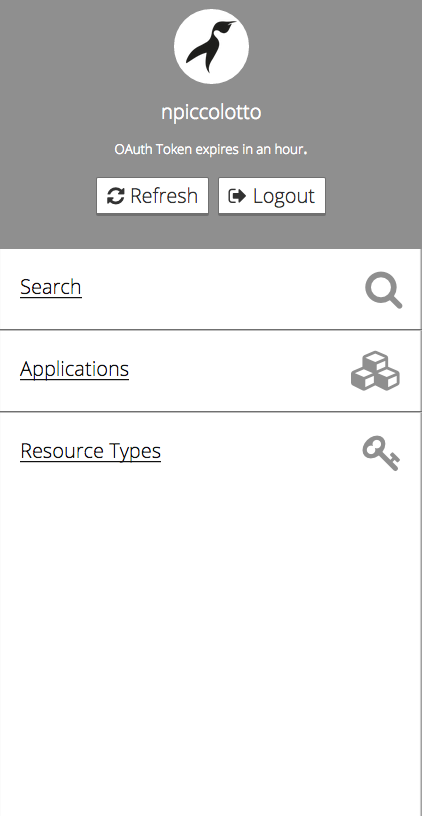

Search
------

It will search for the provided term in

* Kio
* TWINTIP
* Pier One

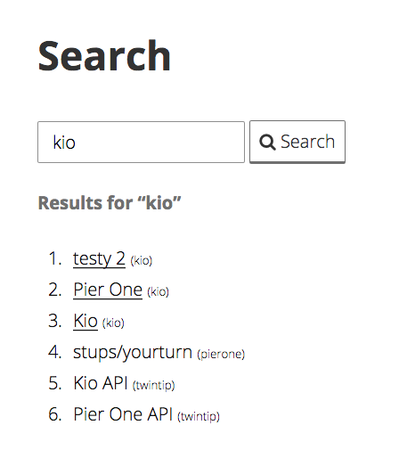

Application
-----------

At first you will see applications from Kio divided into

1. applications owned by your team and
2. applications owned by other teams

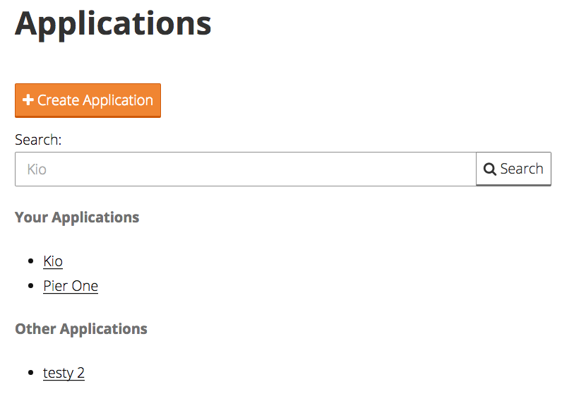

You can create a new application:

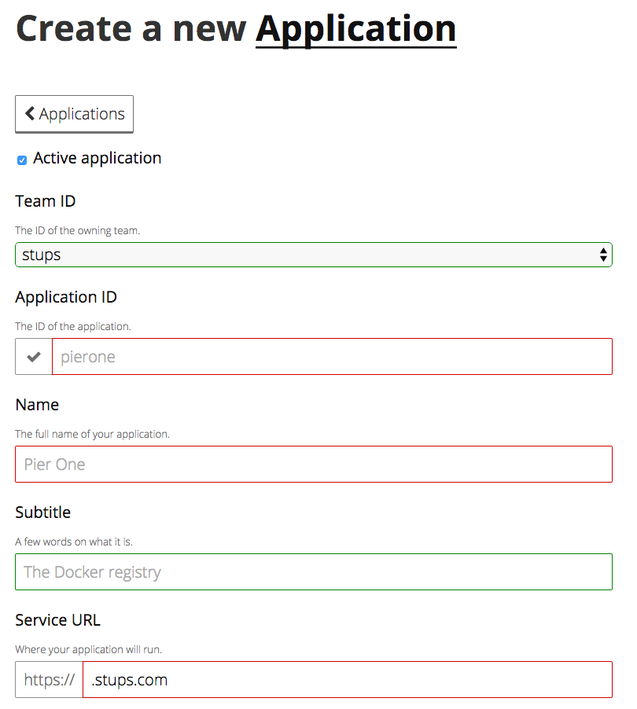

The ID of the application has to be unique, ie. YOUR TURN will check in Kio if it exists already.

You can get an overview of an application's data:

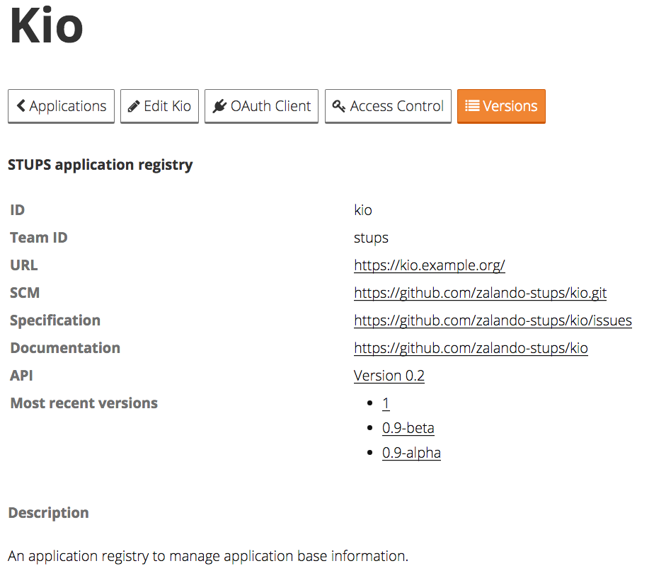

Under "OAuth Client" you define the redirect URL of your application and which scopes it can ask for:

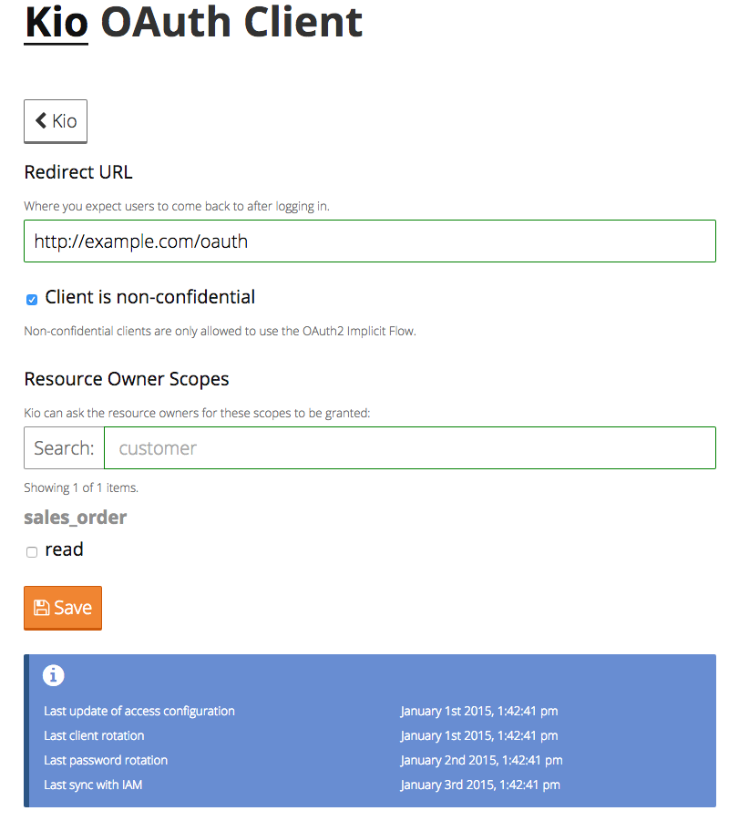

Under "Access Control" you configure what scopes your application "just gets" and where berry should
pull the credentials from:

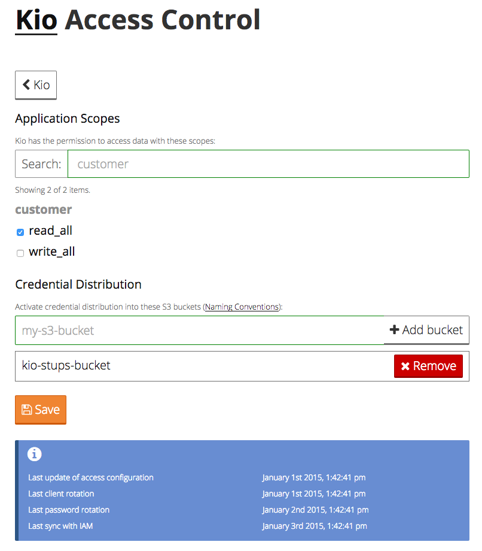

Resource Types
--------------

At first you will see all existing resource types.

.. image:: images/yourturn-resource-list.png

You can create a new one:

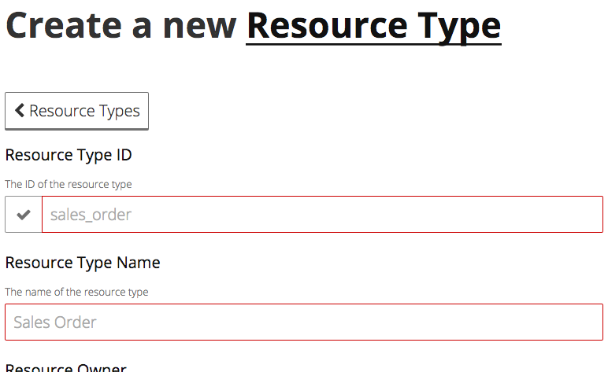

Of course the ID has to be unique again.

You can view details of a resource type:

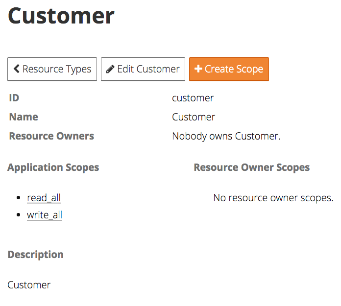

You can create new scopes:

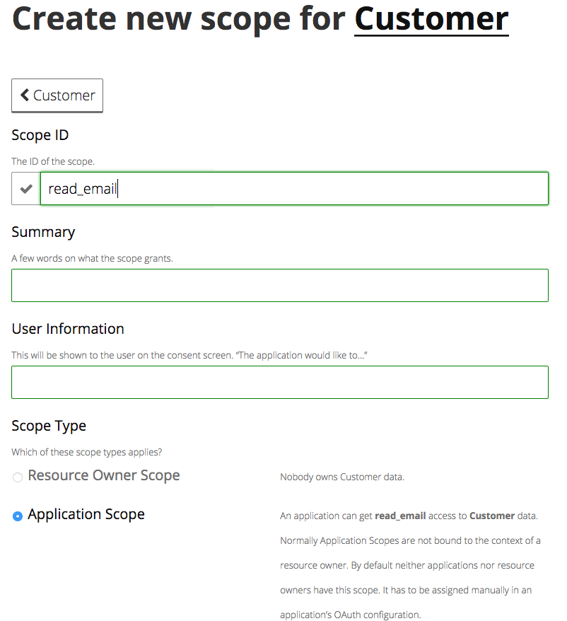

If the resource has an owner, you can select a scope to be a **Resource Owner Scope**
(it has to be requested by the resource owner). If it's not, the scope can only be an
**Application Scope**. Those you can assign to an application in its "Access Control" panel.

And of course you can view details of a scope, along with the applications that use it:

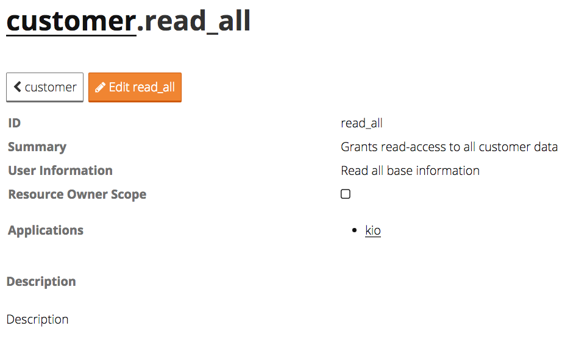
