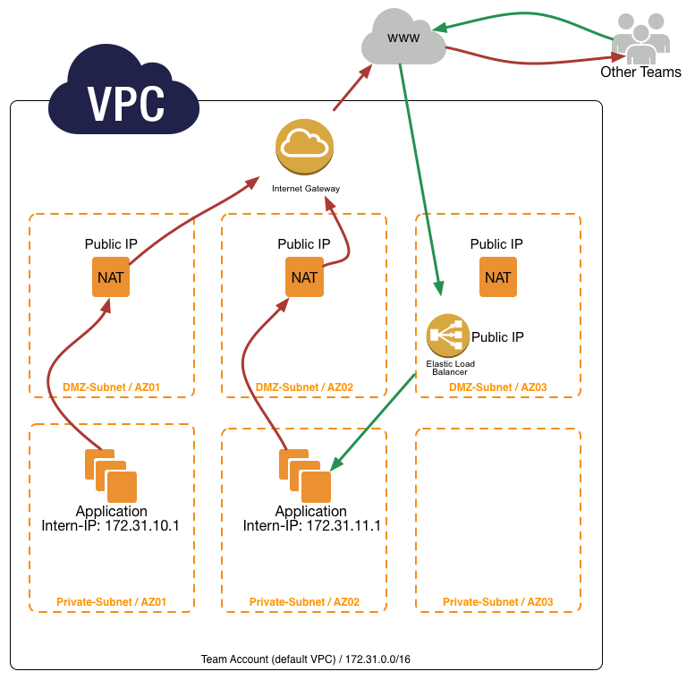

===================
AWS - Account Setup
===================

**Our AWS VPC Account Setup**

.. ATTENTION::
   Nearly everything is public. Services have to communicate over secure transport layer (HTTPS, SSL, SSH etc.)

   Take care of your **Security Groups** in the public DMZ subnets.

Only the public "DMZ" subnets have a direct connection to the internet.  The communication with other teams is only possible over the internet.
Instances in a Private subnet can only talk to the internet via a **NAT-Instance**.
The **NAT-instances** are in multiple Availability Zones (AZ), therefore every **PRIVATE SUBNET** can communicate to the Internet.

If a Team want to talk to another Team they have to do this from the **PRIVATE SUBNET** over the Internet.
Because only the private subnet has the Elastic IP's for outgoing traffic.
The other Team can grant access to this IP's, for example in a Security Group of a ELB (Elastic Loadbalancer)

**Main Points**

   * Communication between teams goes over the **public network**
   * NAT-Instances get **Elastic IP's**
      * every team got 3 Public IP's to communicate to the Internet
      * Other Teams can use these IP's to grant access to their Instances (mostly **ELB**)
   * We will setup 2 different types of subnets **DMZ** and **Internal**
   * **Every Team** got the same default Network **172.31.0.0/16**
      * therefore no **VPN-Tunnel** or **VPC-Peering** is possible between teams
   * Instances in **Internal** can only be accessed through a SSH bastion host

**setup process**

The following pages describe our Amazon Web Services initial setup.
This is only for a whole new AWS Account (a new account for a Team or Service).

.. toctree::
   :maxdepth: 1

   create_aws_account
   manual-setup
   automatic-setup

