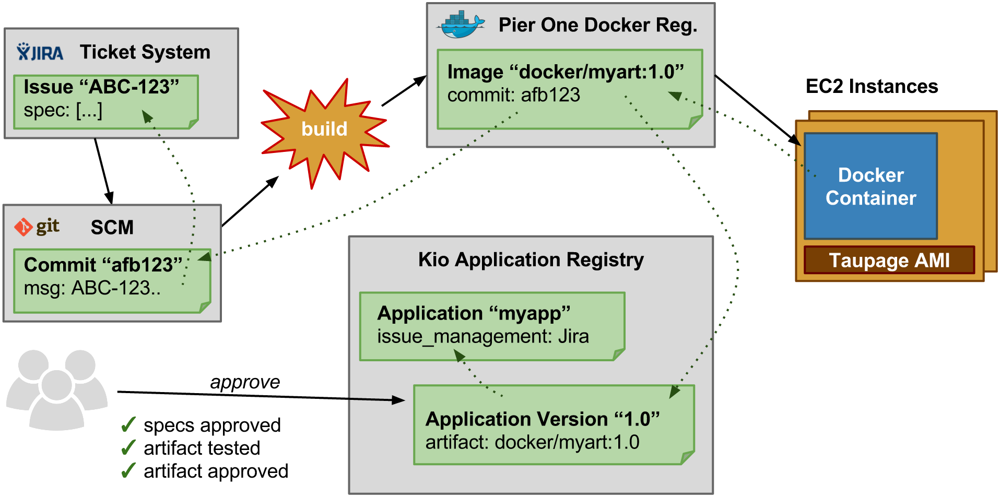

.. _why-stups:

==========
Why STUPS?
==========

STUPS was created with a specific organization setup in mind:

* teams are first class citizens in the organization
* teams are self-organized
* all team members have equal rights
* teams are autonomous and can choose technologies as they think fit
* "team" is the main entity for ownership and security boundaries

This leads to choosing the **one AWS account per team** setup, because:

* AWS IAM policies do not properly constrain teams to only their resources in one big AWS account [#f1]_
* AWS service limits do not allow independent teams to work isolated in one big AWS account [#f2]_

This setup requires tooling to foster team autonomy while complying with company regulations:

* multiple AWS accounts need to be easily manageable
* compliance rules dictate that all changes to production systems need to be audited ("traceability")
* applications need to have a secure way of communicating with each other across AWS accounts

The STUPS platform was created to facilitate the **one AWS account per team** setup and make the setup audit compliant:

* multiple AWS accounts can be configured by a single tool (:ref:`sevenseconds`)
* transparency across AWS accounts is provided by a reporting tool (:ref:`fullstop`)
* traceability of changes is ensured
 * by using a standard way of deploying via Docker (:ref:`pierone`, :ref:`taupage` and :ref:`senza`)
 * by logging all human SSH access (:ref:`even` & :ref:`odd`)
* applications are secured via OAuth (:ref:`mint` & :ref:`berry`)

Traceability
============

How to trace software changes from a running EC2 instance back to the specification:

* The running EC2 instance (running :ref:`taupage` AMI) can be queried for its user data.
* The Taupage user data YAML contains the Docker image (immutable in :ref:`pierone`) and the application ID
* The Docker image contains the SCM source information via ``scm-source.json``. Pier One provides a special REST endpoint to retrieve the SCM source information for any conforming Docker image.
* The :ref:`kio` application registry contains either the specification for the application directly or the used ticket system.
* The SCM commit references specification tickets from the configured ticket system (if a ticket system is used)

.. [#f1] Not all AWS services/products are properly integrated with IAM, e.g. the Elastic Load Balancing (ELB) service only allows global granting of ELB creation.
.. [#f2] Team B might hit AWS service limits for production applications because team A spun up too many instances for performance testing.
