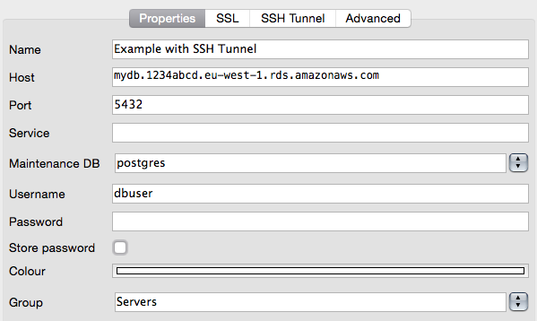
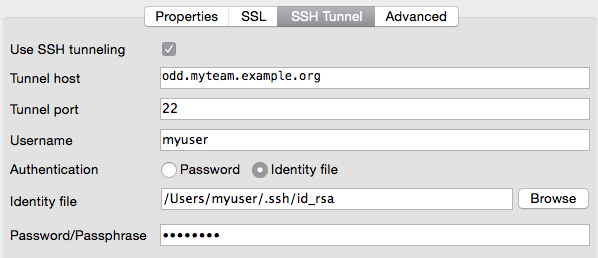
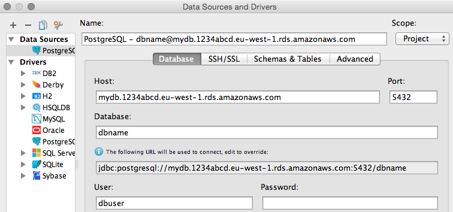
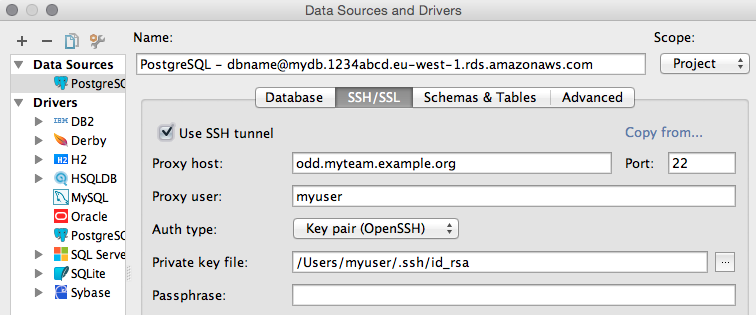

.. _databases:

=========
Databases
=========

Databases should never be publicly available and hence reside in an internal subnet of your
AWS account (See :ref:`account configuration`). This implies that you will have no chance to connect your local postgres
client (e.g. psql or pgAdmin) directly to the host where your database server runs.

But how can I connect from my desktop to an internal RDS instance?
==================================================================

You can use your :ref:`odd` bastion host to establish an **SSH tunnel** and forward the remote database port (e.g. 5432)
to any free port on your local machine. Afterwards you can simply connect your client application to this local port.

This small tutorial will guide you through the setup:

Assumptions
-----------

**Database**

* there is an RDS instance running with the internal endpoint ``mydb.1234abcd.eu-west-1.rds.amazonaws.com``

  - we will use a Postgres installation running on port 5432 in this example, but it should also work with any other
    dbms and port

* the RDS instance's security group permits **inbound traffic on the db port (e.g. 5432) from the bastion host**

**Bastion host**

* your bastion host is available at ``odd-eu-west-1.myteam.example.org``
* your bastion host knows your SSH public key

  - you can use :ref:`piu` to request access to the bastion host before proceeding with the tutorial (use ``piu odd-eu-west-1.myteam.example.org reason``).

* your bastion host's security group permits **inbound traffic on port 22 from your local IP** address
  (should already be in place)
* your bastion host's security group permits **outbound traffic on the db port to your internal instances**
  (should already be in place)

.. _dig-a-tunnel:

Dig a tunnel
------------

* Open a shell and establish an SSH tunnel to your database server like this:

  .. code::

     $ ssh -L 63333:mydb.1234abcd.eu-west-1.rds.amazonaws.com:5432 odd-eu-west-1.myteam.example.org

  * the option ``-L`` opens the tunnel
  * ``63333`` can be replaced by any free port on your local machine. It specifies your end of the tunnel.
  * ``mydb.1234abcd.eu-west-1.rds.amazonaws.com:5432`` is of course the endpoint of the example db instance and the
    other end of the tunnel. We can use the internal DNS name here, because it is from the bastion host's perspective
  * The last argument ``odd-eu-west-1.myteam.example.org`` is the SSH host, we will use as entrance into our VPC and from there
    hop to the desired instance.

* Now your console should look like any ordinary SSH session on ``odd-eu-west-1.myteam.example.org`` with the small difference
  that, as long as you keep the session alive, the tunnel will also be there. There is nothing more work here.
* Open a new shell and try it out: (**Do not close the ssh connection!**)

  .. code::

     $ psql -h localhost -p 63333 -U dbuser dbname

Tool Support
============

There are several database clients, that can do the SSH tunneling for you.

pgAdmin 3
---------

IntelliJ IDEA
-------------

References
==========

* `Postgres Manual`_: Secure TCP/IP Connections with SSH Tunnels

.. _Postgres Manual: http://www.postgresql.org/docs/9.4/static/ssh-tunnels.html
