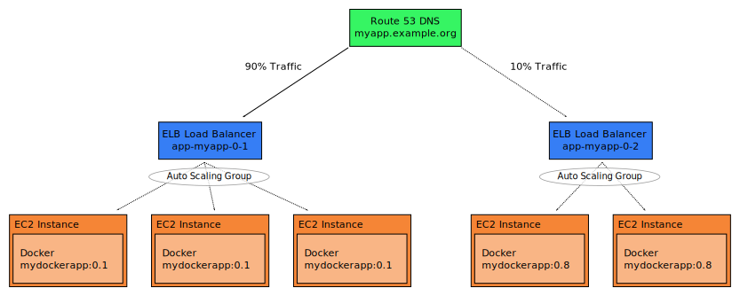

.. _deployment:

==========
Deployment
==========

The :ref:`senza` command line tools allows deploying application stacks.
This page will guide you through the steps necessary to deploy
a Docker-based application with Senza.

Senza was primarily designed to deploy immutable stacks of web applications:

Each immutable stack (application version) is a Cloud Formation stack
with a load balancer (ELB), an auto scaling group and a
versioned DNS domain.
Traffic can be routed to different application versions by changing DNS weights in Route53.

Deploying a new immutable application stack generally involves:

* building your application artifact (e.g. uber jar)
* creating a Docker image
* creating the Cloud Formation stack with Senza (``senza create``)
* routing traffic to the new stack (``senza traffic``)

Prerequisites
=============

First install Python 3.4 on your PC (Ubuntu 14.04 already has it installed, use Homebrew on Mac).

.. Note::

    OS X users may need to set their locale environment to UTF-8 with::

        export LC_ALL=en_US.utf-8
        export LANG=en_US.utf-8

Senza and Mai (required for AWS credentials) can be installed from PyPI using PIP:

.. code-block:: bash

    $ sudo pip3 install --upgrade stups-mai stups-senza

Prepare the deployment artifact
===============================

First deploy the application's artifact (Docker image) to :ref:`pierone`, e.g.:

.. code-block:: bash

    $ cd myapp # enter your application's source folder
    $ # please remember to generate the "scm-source.json",
    $ # which must be in your Docker image!
    $ docker build -t pierone.stups.example.org/myteam/myapp:0.1 .
    $ docker push pierone.stups.example.org/myteam/myapp:0.1

Create a new Senza definition
=============================

In order to call AWS endpoints and to create the Cloud Formation stack, we need to login with :ref:`mai`:

.. code-block:: bash

    $ mai create myteam # create a new profile (if you haven't done so)
    $ mai # login

Next you need to create a new :ref:`Senza deployment definition YAML <senza-definition>` file.
This can be done conveniently with the ``senza init`` command:

.. code-block:: bash

    $ senza init myapp.yaml

.. Note::

    We assume you have your default AWS region ID (e.g. "eu-west-1") configured in ``~/.aws/config``, alternatively you can pass the ``--region`` option to Senza.
    See the `AWS CLI docs`_ for details.

``senza init`` will guide you through a bunch of questions.
Use the "webapp" template and choose the default answers to get a ready-to-use hello world application.
Senza will also create the necessary security groups for you.

Deploying your application with Senza
=====================================

Now we can create the application's Cloud Formation stack with Senza:

.. code-block:: bash

    $ senza create myapp.yaml 1 0.1

.. Note:: The last parameter is a custom parameter "ImageVersion" defined in the SenzaInfo/Parameters section of the above definition YAML.

The stack creation will take some time, we can use the ``events`` command to monitor the progress:

.. code-block:: bash

    $ senza events myapp.yaml 1 --watch=2

The ``--watch`` option tells Senza to refresh the display every 2 seconds until we press ``CTRL-C``.

The "events" command will eventually show ``CREATE_COMPLETE`` for the ``CloudFormation::Stack`` resource if everything went well.

Read the section :ref:`ssh-access` on how to get shell access to your EC2 instances (if needed).

Routing traffic to your application
===================================

Your new application stack should be accessible via the version domain, e.g. "myapp-1.example.org".
You can use the version domain to verify that your application is working (e.g. via automated regression tests).

Eventually you want to route "real" traffic via the main domain (e.g. "myapp.example.org") to your new application stack.
This can be done via Senza`s "traffic" command:

.. code-block:: bash

    $ senza traffic myapp.yaml 1 100 # route 100% traffic to version 1

.. _AWS CLI docs: http://docs.aws.amazon.com/cli/latest/userguide/cli-chap-getting-started.html
