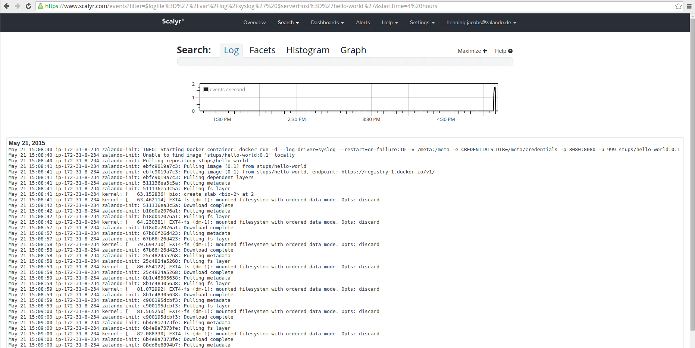

.. _standalone-deployment:

=====================
Standalone Deployment
=====================

.. Note::

   This section is only for users **without** an existing STUPS infrastructure!

Usually the STUPS deployment tooling relies on a completely configured STUPS environment, including:

* a specific STUPS AWS account VPC setup
* a private :ref:`pierone` registry (OAuth secured)
* and a private :ref:`taupage` AMI with baked in configuration

However, you can try out :ref:`senza` deployments with a publicly available :ref:`taupage` AMI.

This page will explain how to try out Senza with a default AWS VPC setup and the public Taupage AMI.

Prerequisites
=============

You need an fresh AWS account with:

* a default AWS VPC setup
  * VPC CIDR: 172.31.0.0/16
  * all subnets are public and have an internet gateway
* a hosted zone in Route 53 (e.g. "\*.stups.example.org") (you don't need to have nameserver delegation for testing)
* a SSL server certificate for your domain (e.g. "\*.stups.example.org") uploaded to IAM and named after your domain (dots replaced with hyphens, i.e. "stups-example-org"). A self-signed certificate will also do for testing.

Installing Senza
================

First install Python 3.4 on your PC (Ubuntu 14.04 already has it installed, use Homebrew on Mac).

.. Note::

    OS X users may need to set their locale environment to UTF-8 with::

        export LC_ALL=en_US.utf-8
        export LANG=en_US.utf-8

Senza can be installed from PyPI using PIP:

.. code-block:: bash

    $ sudo pip3 install --upgrade stups-senza

Check that the installation went fine by printing Senza's version number:

.. code-block:: bash

    $ senza --version

Configuring AWS Credentials
===========================

Senza needs access to your AWS account, so make sure you have your IAM user's access key in ``~/.aws/credentials``:

.. code-block:: bash

    $ cat ~/.aws/credentials
    [default]
    aws_access_key_id = ASIAJK123456789
    aws_secret_access_key = Ygx123i56789abc

Senza uses the AWS CLI's configuration file to know the AWS region you want to deploy to, so make sure you have it set correctly:

.. code-block:: bash

    $ cat ~/.aws/config
    [default]
    region = us-east-1

We will assume you have the AWS credentials and region (we use "us-east-1" in this example) correctly set for the remainder of this section.

.. Note::

    The public Taupage AMI (named "Taupage-Public-AMI-*") used in this section is currently only available in US East (N. Virginia) and EU (Ireland),
    i.e. other regions will not work (however, you can create your own private Taupage AMI anywhere).

Let's try out that Senza can call our AWS API:

.. code-block:: bash

    $ senza li
    Stack Name│Ver.│Status│Created│Description

The ``senza list`` command should print an empty table (just column headers) as we haven't deployed any Cloud Formation stack yet.

Bootstrapping a new Senza Definition
====================================

A Senza definition is essentially a Cloud Formation template as YAML with support for custom Senza components.

We need to create a new Senza definition YAML file to deploy our "Hello World" application:

.. code-block:: bash

    $ senza init helloworld.yaml
    Please select the project template
    1) bgapp: Background app with single EC2 instance
    2) postgresapp: HA Postgres app, which needs an S3 bucket to store WAL files
    3) webapp: HTTP app with auto scaling, ELB and DNS
    Please select (1-3): 3
    Application ID [hello-world]:
    Docker image without tag/version (e.g. "pierone.example.org/myteam/myapp") [stups/hello-world]:
    HTTP port [8080]:
    HTTP health check path [/]:
    EC2 instance type [t2.micro]:
    Mint S3 bucket name [example-stups-mint-123456789123-us-east-1]:
    Checking security group app-hello-world.. OK
    Security group app-hello-world does not exist. Do you want Senza to create it now? [Y/n]:
    Checking security group app-hello-world-lb.. OK
    Security group app-hello-world-lb does not exist. Do you want Senza to create it now? [Y/n]:
    Checking IAM role app-hello-world.. OK
    Creating IAM role app-hello-world.. OK
    Updating IAM role policy of app-hello-world.. OK
    Generating Senza definition file helloworld.yaml.. OK

Senza init will ask you a bunch of question, for our "Hello World" example, you only have to choose the "webapp" template and confirm the default answers with "RETURN".

The selected "webapp" template already takes care of creating the necessary security groups ("app-hello-world*") and IAM role ("app-hello-world").

Before we continue, we need to apply a tiny change to our Senza definition in order to deploy to the default AWS VPC (all public subnets):

.. code-block:: bash

    $ sed -i 's/AssociatePublicIpAddress:\s*false/AssociatePublicIpAddress: true/' helloworld.yaml

We can check the generated Cloud Formation JSON by running ``senza print`` on our newly generated Senza definition:

.. code-block:: bash

    $ senza print helloworld.yaml v1 0.1 # first parameter is stack version, second is Docker image tag
    {
        "AWSTemplateFormatVersion": "2010-09-09",
        "Description": "Hello World (ImageVersion: 0.1)",
        "Mappings": {
            "Images": {
            ...
    # long Cloud Formation JSON after here...

Optional: Configuring Application Logging
=========================================

The Taupage AMI supports logentries_ and Scalyr_ as logging providers.

If you have a Scalyr account, you can easily tell Taupage to stream all application logs to Scalyr:

* Get the Scalyr account key from the Scalyr web ui (you can find the account key for example on the "Help" -> "Install Scalyr Agent" page)
* Insert a new line below "source: stups/hello-world..." containing "scalyr_account_key: <YOUR SCALYR ACCOUNT KEY>"

After deploying, your server's Syslog (``/var/log/syslog``) and application output (``/var/log/application.log``) will be available in the Scalyr web UI:

Deploying a new Senza Application Stack
=======================================

Let's deploy a new immutable application stack using our Senza definition:

.. code-block:: bash

    $ senza create helloworld.yaml v1 0.1 # first parameter is stack version, second is Docker image tag
    Generating Cloud Formation template.. OK
    Creating Cloud Formation stack hello-world-v1.. OK

.. Note::

    By using the Docker image version tag "0.1", we tell Senza to deploy the Docker image "stups/hello-world:0.1"
    from `public Docker Hub`_.

Our Senza ``list`` command output should now look different:

.. code-block:: bash

    $ senza li
    Stack Name │Ver.│Status            │Created│Description
    hello-world v1   CREATE_IN_PROGRESS 16s ago Hello World (ImageVersion: 0.1)

We can watch (``-w``) the Cloud Formation stack creation events:

.. code-block:: bash

    $ senza events hello-world -w 2
    Stack Name │Ver.│Resource Type                     │Resource ID             │Status            │Status Reason              │Event Time
    hello-world v1   CloudFormation::Stack              hello-world-v1           CREATE_IN_PROGRESS User Initiated                  2m ago
    hello-world v1   ElasticLoadBalancing::LoadBalancer AppLoadBalancer          CREATE_IN_PROGRESS                                 2m ago
    hello-world v1   IAM::InstanceProfile               AppServerInstanceProfile CREATE_IN_PROGRESS                                 2m ago
    hello-world v1   IAM::InstanceProfile               AppServerInstanceProfile CREATE_IN_PROGRESS Resource creation Initiated     2m ago
    hello-world v1   ElasticLoadBalancing::LoadBalancer AppLoadBalancer          CREATE_IN_PROGRESS Resource creation Initiated     2m ago
    hello-world v1   ElasticLoadBalancing::LoadBalancer AppLoadBalancer          CREATE_COMPLETE                                    2m ago
    hello-world v1   Route53::RecordSet                 MainDomain               CREATE_IN_PROGRESS                                 2m ago
    hello-world v1   Route53::RecordSet                 VersionDomain            CREATE_IN_PROGRESS                                 2m ago
    hello-world v1   Route53::RecordSet                 VersionDomain            CREATE_IN_PROGRESS Resource creation Initiated     2m ago
    hello-world v1   Route53::RecordSet                 MainDomain               CREATE_IN_PROGRESS Resource creation Initiated     2m ago
    hello-world v1   IAM::InstanceProfile               AppServerInstanceProfile CREATE_COMPLETE                                   13s ago
    hello-world v1   AutoScaling::LaunchConfiguration   AppServerConfig          CREATE_IN_PROGRESS                                11s ago
    hello-world v1   AutoScaling::LaunchConfiguration   AppServerConfig          CREATE_IN_PROGRESS Resource creation Initiated    10s ago
    hello-world v1   AutoScaling::LaunchConfiguration   AppServerConfig          CREATE_COMPLETE                                    9s ago
    hello-world v1   AutoScaling::AutoScalingGroup      AppServer                CREATE_IN_PROGRESS                                 6s ago
    hello-world v1   AutoScaling::AutoScalingGroup      AppServer                CREATE_IN_PROGRESS Resource creation Initiated     5s ago

Finally our stack listing should show "CREATE_COMPLETE" in green letters:

.. code-block:: bash

    $ senza li
    Stack Name │Ver.│Status         │Created│Description
    hello-world v1   CREATE_COMPLETE  6m ago Hello World (ImageVersion: 0.1)

We can check our created domains:

.. code-block:: bash

    $ senza domains
    Stack Name │Ver.│Resource ID  │Domain                          │Weight│Type │Value                                             │Create Time
    hello-world v1   VersionDomain hello-world-v1.stups.example.org        CNAME hello-world-v1-7873266.us-east-1.elb.amazonaws.com      4m ago
    hello-world v1   MainDomain    hello-world.stups.example.org    0      CNAME hello-world-v1-7873266.us-east-1.elb.amazonaws.com      4m ago

Checking that our new "Hello World" application was successfully deployed and is responding:

.. code-block:: bash

    $ curl https://hello-world-v1.stups.example.org/
    "Hello World!"

If you just created a hosted zone without nameserver delegation and your SSL cert is only self-signed, we can still check our application
by using the ELB domain name and ignoring CA validation (``--insecure``):

.. code-block:: bash

    $ curl --insecure https://hello-world-v1-7873266.us-east-1.elb.amazonaws.com/
    "Hello World!"

As soon as we are happy with our new version, we can route traffic via the main domain:

.. code-block:: bash

    $ senza traffic hello-world v1 100
    Calculating new weights.. OK
    Stack Name │Version│Identifier    │Old Weight%│Delta│Compensation│New Weight%│Current
    hello-world v1      hello-world-v1         0.0 100.0                    100.0 <
    Setting weights for hello-world.stups.example.org... OK

After the usual DNS propagation delays, we should be able to have our "Hello World" application running on the main domain:

.. code-block:: bash

    $ curl https://hello-world.stups.example.org/
    "Hello World!"

That's all for now!

.. _public Docker Hub: https://registry.hub.docker.com/u/stups/hello-world/
.. _logentries: https://logentries.com/
.. _Scalyr: https://www.scalyr.com/
